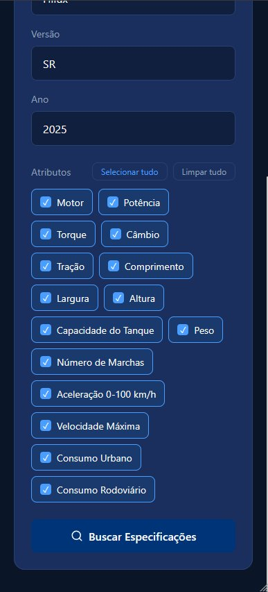
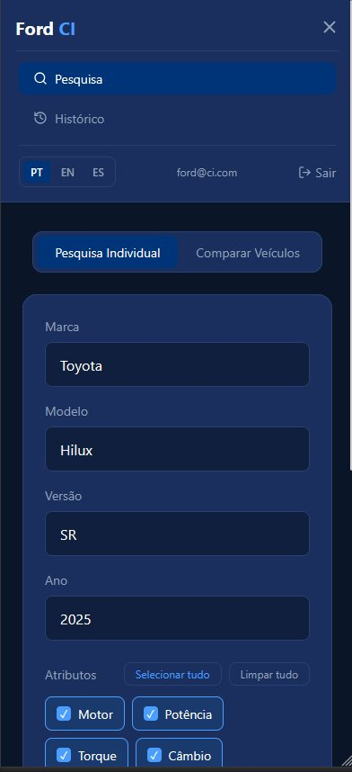
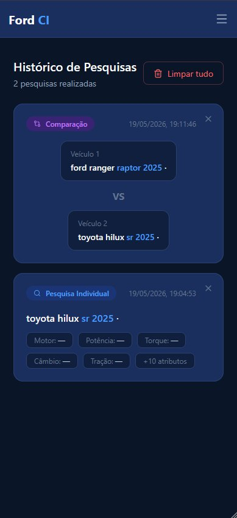
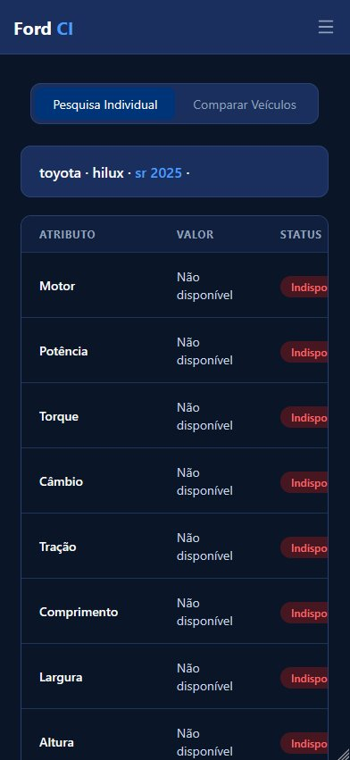
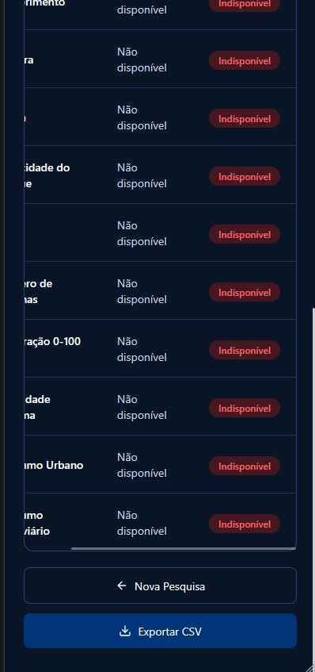
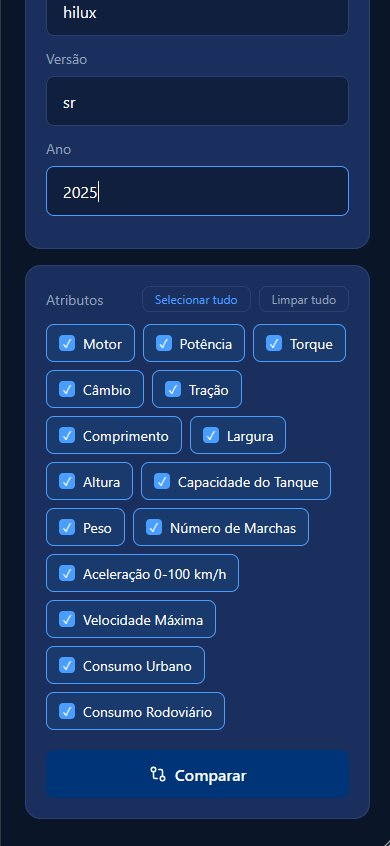
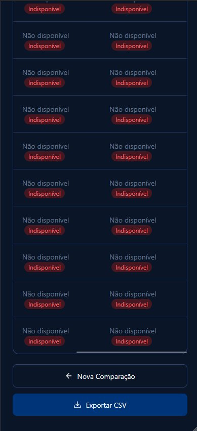

# projeto-ford-inteligencia
API para extração automática de specs de veículos concorrentes usando web scraping + LLM local. FastAPI + React + SQLite + Ollama. Desafio Ford FIAP 2026.

🔧 Ford Commercial Intelligence

```text
projeto-ford/
├── backend/
│   ├── app/
│   │   ├── __init__.py
│   │   ├── main.py                 # FastAPI app, rotas principais
│   │   ├── database.py             # Conexão com SQLite, funções de cache
│   │   ├── models.py               # Modelos Pydantic (schemas)
│   │   ├── scraping.py             # Coleta com requests/BeautifulSoup
│   │   ├── llm_client.py           # Chamada ao Ollama (extração JSON)
│   │   └── utils.py                # Funções auxiliares (hash, validação)
│   ├── requirements.txt            # Dependências: fastapi, uvicorn, requests, bs4, etc.
│   └── fichas.db                   # Banco SQLite (será criado na 1ª execução)
├── frontend/
│   ├── src/
│   │   ├── App.jsx                 # Componente principal React
│   │   ├── api.js                  # Chamadas para o backend
│   │   └── components/...
│   ├── package.json
│   └── tailwind.config.js
├── README.md                       # Documentação do projeto (inclui contrato da API)
└── .gitignore
```
#  Ford CI — Frontend

Documentação técnica do frontend da aplicação **Ford Intelligence**, desenvolvida para o Desafio Ford — FIAP 2025.

---

##  Sobre o Frontend

O frontend do Ford CI é uma SPA (Single Page Application) construída em React que permite aos usuários pesquisar e comparar especificações técnicas de veículos de forma rápida e intuitiva. A interface foi desenvolvida com foco em usabilidade, responsividade e suporte a múltiplos idiomas.

---

## Por que escolhemos este desafio:

O Desafio 1 nos chamou atenção por abordar um problema real e frequente no mercado automotivo. Quem já tentou comparar dois veículos sabe como é frustrante ter que acessar vários sites diferentes, lidar com informações inconsistentes e ainda assim não encontrar tudo o que precisa em um só lugar. Enxergamos nesse desafio a oportunidade de construir uma ferramenta centralizada que resolve exatamente isso — reunindo especificações técnicas de diferentes modelos em uma interface única, clara e fácil de usar. Além disso, o tema se encaixa bem com o uso de inteligência de dados e automação, o que tornou o desenvolvimento mais desafiador e aprendizado mais rico para o grupo.

---

##  Integrantes do Grupo

| Nome | RM |
|---|---|
| Maria Alice Freitas Araújo | RM557516 |
| Pedro Henrique Mendes dos Santos | RM555332 |
| João Victor Soave | RM557595 |
| Vinícius Fernandes Tavares Bittencourt | RM558909 |
| Rafael Teofilo Lucena | RM555600 |

---

##  Funcionalidades

- **Login com autenticação JWT** — acesso protegido com token salvo no localStorage
- **Pesquisa Individual** — busca especificações de um veículo por marca, modelo, versão e ano
- **Comparação de Veículos** — compara dois veículos lado a lado com os atributos escolhidos
- **Seleção de Atributos** — o usuário define quais especificações quer visualizar
- **Histórico de Pesquisas** — pesquisas anteriores salvas localmente, com opção de reabrir ou excluir
- **Exportação CSV** — resultados exportados direto pelo navegador sem dependência externa
- **Internacionalização** — interface em Português, Inglês e Espanhol
- **Layout Responsivo** — menu hamburguer no mobile, tabelas com scroll horizontal

---

##  Estrutura de Pastas

```
frontend/
└── src/
    ├── components/               # Componentes reutilizáveis
    │   ├── Navbar.jsx            # Barra de navegação com menu mobile
    │   ├── PesquisaIndividual.jsx
    │   ├── CompararVeiculos.jsx
    │   ├── ResultadoIndividual.jsx
    │   └── ResultadoComparacao.jsx
    ├── pages/                    # Páginas da aplicação
    │   ├── Login.jsx
    │   ├── Pesquisa.jsx
    │   └── Historico.jsx
    ├── context/                  # Estado global via Context API
    │   ├── AuthContext.jsx       # Autenticação e token JWT
    │   ├── HistoricoContext.jsx  # Histórico persistido no localStorage
    │   └── AtributosContext.jsx
    ├── data/
    │   └── mock.js               # Integração com a API do backend
    ├── i18n/                     # Traduções PT / EN / ES
    │   ├── pt.js
    │   ├── en.js
    │   ├── es.js
    │   └── index.js
    ├── App.jsx                   # Roteamento e providers globais
    └── main.jsx
```

---

##  Stack e Decisões Técnicas

| Tecnologia | Versão | Motivo da escolha |
|---|---|---|
| React | 19 | Componentização, ecosistema maduro, mercado consolidado |
| Vite | 8 | Build extremamente rápido, hot reload nativo |
| Tailwind CSS | 4 | Estilização direta no JSX sem arquivos CSS separados |
| React Router DOM | 7 | Roteamento SPA com suporte a rotas protegidas |
| i18next | 26 | Internacionalização sem recarregar a página |
| Lucide React | — | Ícones leves e consistentes visualmente |
| Axios | 1.x | Requisições HTTP com interceptors e tratamento centralizado |

### Gerenciamento de Estado

Optamos pela **Context API nativa** do React em vez de Redux ou Zustand. Com três contextos bem definidos — autenticação, histórico e atributos — o estado ficou simples e sem dependências extras desnecessárias para o escopo do projeto.

### Persistência do Histórico

O `HistoricoContext` salva cada pesquisa no `localStorage` automaticamente via `useEffect`. Isso garante que o histórico sobrevive ao fechamento do navegador sem precisar de nenhuma chamada ao backend.

### Responsividade

A Navbar usa `hidden md:flex` e `md:hidden` do Tailwind para alternar entre o layout desktop e o menu hamburguer no mobile. As tabelas de resultado usam `overflow-x-auto` com `min-width` fixo para garantir scroll horizontal em telas pequenas sem quebrar o layout.

### Rotas Protegidas

O componente `RotaProtegida` no `App.jsx` verifica se há um usuário autenticado no contexto antes de renderizar qualquer página. Caso não haja, redireciona automaticamente para `/login`.

---

##  Como Rodar o Frontend

### Pré-requisitos

- [Node.js](https://nodejs.org/) v18 ou superior
- Backend rodando em `http://localhost:8000`

### Passo a passo

 **Atenção:** O frontend consome a API do backend. Para que as pesquisas funcionem corretamente, o backend precisa estar rodando em `http://localhost:8000` antes de usar a aplicação.

```bash
# 1. Entre na pasta do frontend
cd frontend

# 2. Instale as dependências
npm install

# 3. Suba o servidor de desenvolvimento
npm run dev
```

Acesse `http://localhost:5173` no navegador.

**Credenciais de demonstração:**
```
E-mail: ford@ci.com
Senha:  ford123
```

### Scripts disponíveis

| Comando | O que faz |
|---|---|
| `npm run dev` | Sobe o servidor de desenvolvimento com hot reload |
| `npm run build` | Gera o build de produção na pasta `dist/` |
| `npm run preview` | Visualiza o build de produção localmente |
| `npm run lint` | Roda o ESLint em todos os arquivos |

---

##  Demonstração Visual

### Tela de Login


---

### Pesquisa Individual — Formulário



---

### Navbar Mobile — Menu Hamburguer


---

### Resultado da Pesquisa Individual



---

### Comparação de Veículos — Formulário



---

### Resultado da Comparação



---

### Histórico de Pesquisas


---

##  Repositório

[https://github.com/challengelotus/projeto-ford-inteligencia](https://github.com/challengelotus/projeto-ford-inteligencia)

---

##  Próximos Passos

Com mais tempo, o grupo implementaria:

- **Imagens dos veículos** — exibir a foto do carro pesquisado ou comparado diretamente na tela de resultado, consumindo uma API de imagens automotivas (como a Car Image API) ou integrando com scraping para enriquecer visualmente a experiência do usuário
- **Gráficos comparativos** em formato radar ou barras para visualização mais clara dos atributos
- **Filtro no histórico** por data, veículo ou tipo de pesquisa
- **Cache de requisições** para evitar chamadas repetidas para o mesmo veículo
- **Testes automatizados** com cobertura dos componentes principais
- **Modo offline** exibindo resultados de pesquisas já realizadas sem conexão com o backend

