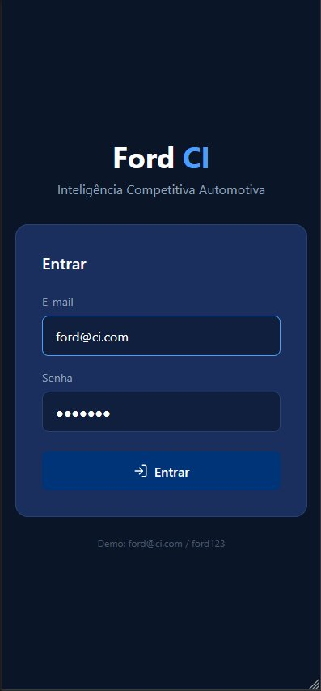
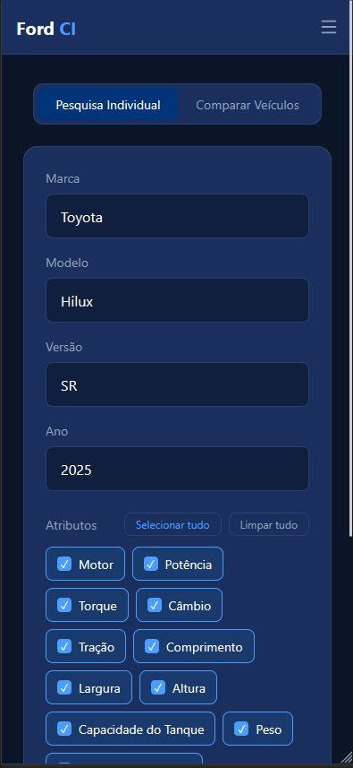
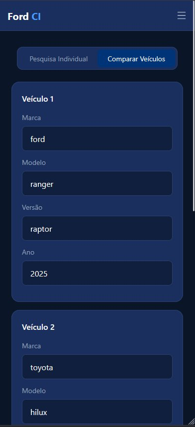
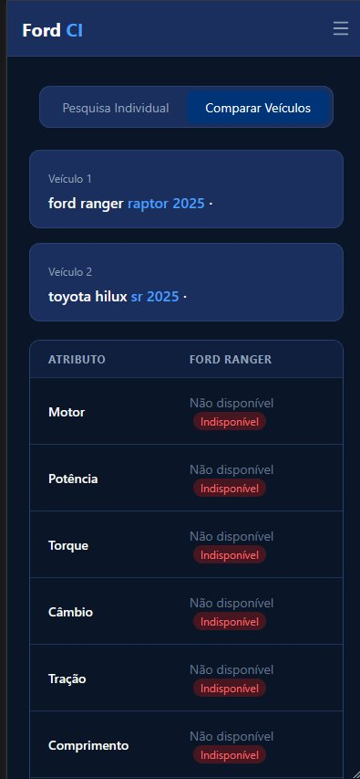

# projeto-ford-inteligencia
API para extração automática de specs de veículos concorrentes usando web scraping + LLM local. FastAPI + React + SQLite + Ollama. Desafio Ford FIAP 2026.

🔧 Ford Commercial Intelligence

```text
projeto-ford/
├── backend/
│   ├── app/
│   │   ├── __init__.py
│   │   ├── main.py                 # FastAPI app, rotas principais
│   │   ├── database.py             # Conexão com SQLite, funções de cache
│   │   ├── models.py               # Modelos Pydantic (schemas)
│   │   ├── scraping.py             # Coleta com requests/BeautifulSoup
│   │   ├── llm_client.py           # Chamada ao Ollama (extração JSON)
│   │   └── utils.py                # Funções auxiliares (hash, validação)
│   ├── requirements.txt            # Dependências: fastapi, uvicorn, requests, bs4, etc.
│   └── fichas.db                   # Banco SQLite (será criado na 1ª execução)
├── frontend/
│   ├── src/
│   │   ├── App.jsx                 # Componente principal React
│   │   ├── api.js                  # Chamadas para o backend
│   │   └── components/...
│   ├── package.json
│   └── tailwind.config.js
├── README.md                       # Documentação do projeto (inclui contrato da API)
└── .gitignore
```
#  Ford CI — Frontend

Documentação técnica do frontend da aplicação **Ford Intelligence**, desenvolvida para o Desafio Ford — FIAP 2025.

---

##  Sobre o Frontend

O frontend do Ford CI é uma SPA (Single Page Application) construída em React que permite aos usuários pesquisar e comparar especificações técnicas de veículos de forma rápida e intuitiva. A interface foi desenvolvida com foco em usabilidade, responsividade e suporte a múltiplos idiomas.

---

## Por que escolhemos este desafio:

O Desafio 1 nos chamou atenção por abordar um problema real e frequente no mercado automotivo. Quem já tentou comparar dois veículos sabe como é frustrante ter que acessar vários sites diferentes, lidar com informações inconsistentes e ainda assim não encontrar tudo o que precisa em um só lugar. Enxergamos nesse desafio a oportunidade de construir uma ferramenta centralizada que resolve exatamente isso — reunindo especificações técnicas de diferentes modelos em uma interface única, clara e fácil de usar. Além disso, o tema se encaixa bem com o uso de inteligência de dados e automação, o que tornou o desenvolvimento mais desafiador e aprendizado mais rico para o grupo.

---

##  Integrantes do Grupo

| Nome | RM |
|---|---|
| Maria Alice Freitas Araújo | RM557516 |
| Pedro Henrique Mendes dos Santos | RM555332 |
| João Victor Soave | RM557595 |
| Vinícius Fernandes Tavares Bittencourt | RM558909 |
| Rafael Teofilo Lucena | RM555600 |

---

##  Funcionalidades

- **Login com autenticação JWT** — acesso protegido com token salvo no localStorage
- **Pesquisa Individual** — busca especificações de um veículo por marca, modelo, versão e ano
- **Comparação de Veículos** — compara dois veículos lado a lado com os atributos escolhidos
- **Seleção de Atributos** — o usuário define quais especificações quer visualizar
- **Histórico de Pesquisas** — pesquisas anteriores salvas localmente, com opção de reabrir ou excluir
- **Exportação CSV** — resultados exportados direto pelo navegador sem dependência externa
- **Internacionalização** — interface em Português, Inglês e Espanhol
- **Layout Responsivo** — menu hamburguer no mobile, tabelas com scroll horizontal

---

##  Estrutura de Pastas

```
frontend/
└── src/
    ├── components/               # Componentes reutilizáveis
    │   ├── Navbar.jsx            # Barra de navegação com menu mobile
    │   ├── PesquisaIndividual.jsx
    │   ├── CompararVeiculos.jsx
    │   ├── ResultadoIndividual.jsx
    │   └── ResultadoComparacao.jsx
    ├── pages/                    # Páginas da aplicação
    │   ├── Login.jsx
    │   ├── Pesquisa.jsx
    │   └── Historico.jsx
    ├── context/                  # Estado global via Context API
    │   ├── AuthContext.jsx       # Autenticação e token JWT
    │   ├── HistoricoContext.jsx  # Histórico persistido no localStorage
    │   └── AtributosContext.jsx
    ├── data/
    │   └── mock.js               # Integração com a API do backend
    ├── i18n/                     # Traduções PT / EN / ES
    │   ├── pt.js
    │   ├── en.js
    │   ├── es.js
    │   └── index.js
    ├── App.jsx                   # Roteamento e providers globais
    └── main.jsx
```

---

##  Stack e Decisões Técnicas

| Tecnologia | Versão | Motivo da escolha |
|---|---|---|
| React | 19 | Componentização, ecosistema maduro, mercado consolidado |
| Vite | 8 | Build extremamente rápido, hot reload nativo |
| Tailwind CSS | 4 | Estilização direta no JSX sem arquivos CSS separados |
| React Router DOM | 7 | Roteamento SPA com suporte a rotas protegidas |
| i18next | 26 | Internacionalização sem recarregar a página |
| Lucide React | — | Ícones leves e consistentes visualmente |
| Axios | 1.x | Requisições HTTP com interceptors e tratamento centralizado |

### Gerenciamento de Estado

Optamos pela **Context API nativa** do React em vez de Redux ou Zustand. Com três contextos bem definidos — autenticação, histórico e atributos — o estado ficou simples e sem dependências extras desnecessárias para o escopo do projeto.

### Persistência do Histórico

O `HistoricoContext` salva cada pesquisa no `localStorage` automaticamente via `useEffect`. Isso garante que o histórico sobrevive ao fechamento do navegador sem precisar de nenhuma chamada ao backend.

### Responsividade

A Navbar usa `hidden md:flex` e `md:hidden` do Tailwind para alternar entre o layout desktop e o menu hamburguer no mobile. As tabelas de resultado usam `overflow-x-auto` com `min-width` fixo para garantir scroll horizontal em telas pequenas sem quebrar o layout.

### Rotas Protegidas

O componente `RotaProtegida` no `App.jsx` verifica se há um usuário autenticado no contexto antes de renderizar qualquer página. Caso não haja, redireciona automaticamente para `/login`.

---

##  Como Rodar o Frontend

### Pré-requisitos

- [Node.js](https://nodejs.org/) v18 ou superior
- Backend rodando em `http://localhost:8000`

### Passo a passo

 **Atenção:** O frontend consome a API do backend. Para que as pesquisas funcionem corretamente, o backend precisa estar rodando em `http://localhost:8000` antes de usar a aplicação.

```bash
# 1. Entre na pasta do frontend
cd frontend

# 2. Instale as dependências
npm install

# 3. Suba o servidor de desenvolvimento
npm run dev
```

Acesse `http://localhost:5173` no navegador.

**Credenciais de demonstração:**
```
E-mail: ford@ci.com
Senha:  ford123
```

### Scripts disponíveis

| Comando | O que faz |
|---|---|
| `npm run dev` | Sobe o servidor de desenvolvimento com hot reload |
| `npm run build` | Gera o build de produção na pasta `dist/` |
| `npm run preview` | Visualiza o build de produção localmente |
| `npm run lint` | Roda o ESLint em todos os arquivos |

---

##  Demonstração Visual

### Tela de Login


---

### Pesquisa Individual — Formulário



---

### Navbar Mobile — Menu Hamburguer


---

### Resultado da Pesquisa Individual


---

### Comparação de Veículos — Formulário



---

### Resultado da Comparação



---

### Histórico de Pesquisas


---

## Contrato da API

## 1. Informações gerais da API

### URL base em ambiente local

```http
http://localhost:8000
```

### Documentação interativa do FastAPI

Após iniciar a aplicação, a documentação automática pode ser acessada em:

```http
http://localhost:8000/docs
```

Também está disponível a documentação alternativa em:

```http
http://localhost:8000/redoc
```

### Formato de dados

A API utiliza JSON como formato principal de entrada e saída, exceto no endpoint de login, que utiliza `application/x-www-form-urlencoded` por seguir o padrão OAuth2 Password Flow.

### Autenticação

A maior parte dos endpoints protegidos exige o envio de um token JWT no cabeçalho da requisição:

```http
Authorization: Bearer <access_token>
```

---

## 2. Fluxo de autenticação

1. O usuário envia e-mail e senha para o endpoint de login.
2. A API valida as credenciais.
3. Em caso de sucesso, retorna um `access_token` e um `refresh_token`.
4. O `access_token` deve ser usado nas próximas requisições protegidas.
5. O endpoint de refresh pode ser usado para gerar um novo token de acesso.

---

## 3. Endpoints de autenticação

## 3.1 Login do usuário

Autentica o usuário e retorna os tokens de acesso.

### Requisição

```http
POST /auth/token
```

### Autenticação exigida

Não.

### Content-Type

```http
application/x-www-form-urlencoded
```

### Parâmetros do formulário

| Campo | Tipo | Obrigatório | Descrição |
|---|---|---:|---|
| `username` | string | Sim | E-mail do usuário. O nome `username` é utilizado por compatibilidade com OAuth2. |
| `password` | string | Sim | Senha do usuário. |

### Exemplo de requisição

```bash
curl -X POST "http://localhost:8000/auth/token" \
  -H "Content-Type: application/x-www-form-urlencoded" \
  -d "username=ford@ci.com&password=ford123"
```

### Resposta de sucesso

**Status:** `200 OK`

```json
{
  "access_token": "jwt_access_token",
  "refresh_token": "jwt_refresh_token",
  "token_type": "bearer"
}
```

### Campos da resposta

| Campo | Tipo | Descrição |
|---|---|---|
| `access_token` | string | Token JWT usado para acessar endpoints protegidos. |
| `refresh_token` | string | Token JWT usado para renovar o token de acesso. |
| `token_type` | string | Tipo do token. O valor esperado é `bearer`. |

### Possíveis erros

| Status | Situação | Exemplo de resposta |
|---:|---|---|
| `401 Unauthorized` | E-mail ou senha incorretos | `{ "detail": "Incorrect email or password" }` |
| `422 Unprocessable Entity` | Dados obrigatórios ausentes ou inválidos | Resposta padrão de validação do FastAPI |

---

## 3.2 Renovação de token

Gera um novo `access_token` para o usuário autenticado.

### Requisição

```http
POST /auth/refresh
```

### Autenticação exigida

Sim.

```http
Authorization: Bearer <token>
```

### Corpo da requisição

Não há corpo obrigatório.

### Exemplo de requisição

```bash
curl -X POST "http://localhost:8000/auth/refresh" \
  -H "Authorization: Bearer jwt_refresh_token"
```

### Resposta de sucesso

**Status:** `200 OK`

```json
{
  "access_token": "novo_jwt_access_token",
  "token_type": "bearer"
}
```

### Campos da resposta

| Campo | Tipo | Descrição |
|---|---|---|
| `access_token` | string | Novo token JWT de acesso. |
| `token_type` | string | Tipo do token. O valor esperado é `bearer`. |

### Possíveis erros

| Status | Situação | Exemplo de resposta |
|---:|---|---|
| `401 Unauthorized` | Token ausente, expirado ou inválido | `{ "detail": "Could not validate credentials" }` |

### Observação de contrato

O objetivo deste endpoint é renovar o token de acesso. Em uma implementação ideal, ele deve validar especificamente um `refresh_token`, diferenciando-o de um `access_token`.

---

## 4. Endpoints de usuário

## 4.1 Consultar usuário autenticado

Retorna os dados básicos do usuário autenticado.

### Requisição

```http
GET /users/me/
```

### Autenticação exigida

Sim.

```http
Authorization: Bearer <access_token>
```

### Exemplo de requisição

```bash
curl -X GET "http://localhost:8000/users/me/" \
  -H "Authorization: Bearer jwt_access_token"
```

### Resposta de sucesso

**Status:** `200 OK`

```json
{
  "nome": "Administrador Ford",
  "email": "ford@ci.com",
  "role": "admin"
}
```

### Campos da resposta

| Campo | Tipo | Descrição |
|---|---|---|
| `nome` | string | Nome do usuário. |
| `email` | string | E-mail do usuário. |
| `role` | string | Perfil do usuário. Exemplo: `admin` ou `user`. |

### Possíveis erros

| Status | Situação | Exemplo de resposta |
|---:|---|---|
| `401 Unauthorized` | Token ausente, expirado ou inválido | `{ "detail": "Could not validate credentials" }` |

---

## 5. Endpoints de veículos

## 5.1 Buscar veículo

Busca as especificações técnicas de um veículo a partir de marca, modelo, versão e ano. Caso o veículo já exista no banco de dados e o cache não seja ignorado, a API retorna o registro existente. Caso contrário, realiza a busca das informações, salva o veículo e retorna o novo registro.

### Requisição

```http
GET /veiculos/busca
```

### Autenticação exigida

Sim.

```http
Authorization: Bearer <access_token>
```

### Rate limit

Este endpoint possui limite de uso configurado para:

```txt
20 requisições por minuto
```

### Query parameters

| Parâmetro | Tipo | Obrigatório | Validação | Descrição |
|---|---|---:|---|---|
| `marca` | string | Sim | Mínimo 2 e máximo 50 caracteres | Marca do veículo. |
| `modelo` | string | Sim | Mínimo 1 e máximo 50 caracteres | Modelo do veículo. |
| `versao` | string | Sim | Mínimo 1 e máximo 100 caracteres | Versão do veículo. |
| `ano` | integer | Sim | Entre 1886 e 2027 | Ano do veículo. |
| `fonte` | string | Não | Máximo 50 caracteres | Fonte da informação. Valor padrão: `padrao`. |
| `bypass_cache` | boolean | Não | `true` ou `false` | Quando `true`, força atualização dos dados mesmo que o veículo já exista no cache. |

### Exemplo de requisição

```bash
curl -X GET "http://localhost:8000/veiculos/busca?marca=Ford&modelo=Mustang&versao=GT&ano=2024&fonte=padrao&bypass_cache=false" \
  -H "Authorization: Bearer jwt_access_token"
```

### Resposta de sucesso

**Status:** `200 OK`

```json
{
  "id": 1,
  "marca": "Ford",
  "modelo": "Mustang",
  "versao": "GT",
  "ano": 2024,
  "fonte": "padrao",
  "hash_busca": "hash_gerado_para_a_busca",
  "criado_em": "2026-05-25T10:30:00",
  "especificacoes": {
    "motor": "2.0 Turbo",
    "potencia": "250 cv",
    "torque": "38 kgfm",
    "cambio": "Automático de 8 marchas",
    "tracao": "AWD",
    "suspensao": "Independente",
    "freios": "Disco ventilado",
    "rodas_pneus": "Aro 18",
    "farois": "LED",
    "modos_conducao": "Normal, Sport, Eco",
    "preco": "R$ 250.000"
  }
}
```

### Campos da resposta

| Campo | Tipo | Descrição |
|---|---|---|
| `id` | integer | Identificador único do veículo. |
| `marca` | string | Marca do veículo. |
| `modelo` | string | Modelo do veículo. |
| `versao` | string | Versão pesquisada. |
| `ano` | integer | Ano do veículo. |
| `fonte` | string | Fonte utilizada para obtenção dos dados. |
| `hash_busca` | string | Hash único gerado com base em marca, modelo, versão e ano. |
| `criado_em` | datetime | Data e hora de criação ou atualização do registro. |
| `especificacoes` | object | Objeto com as especificações técnicas do veículo. |

### Campos do objeto `especificacoes`

| Campo | Tipo | Descrição |
|---|---|---|
| `motor` | string | Motorização do veículo. |
| `potencia` | string | Potência declarada. |
| `torque` | string | Torque declarado. |
| `cambio` | string | Tipo de câmbio. |
| `tracao` | string | Tipo de tração. |
| `suspensao` | string | Tipo de suspensão. |
| `freios` | string | Tipo de freios. |
| `rodas_pneus` | string | Informações de rodas e pneus. |
| `farois` | string | Tipo de faróis. |
| `modos_conducao` | string | Modos de condução disponíveis. |
| `preco` | string | Preço estimado ou informado pela fonte. |

### Possíveis erros

| Status | Situação | Exemplo de resposta |
|---:|---|---|
| `401 Unauthorized` | Token ausente, expirado ou inválido | `{ "detail": "Could not validate credentials" }` |
| `422 Unprocessable Entity` | Query parameters inválidos | Resposta padrão de validação do FastAPI |
| `429 Too Many Requests` | Limite de requisições excedido | Resposta padrão do SlowAPI |

---

## 6. Endpoints de histórico

## 6.1 Criar registro de histórico

Cria um registro de histórico associado ao usuário autenticado. O histórico pode representar uma busca individual ou uma comparação entre veículos.

### Requisição

```http
POST /historico/
```

### Autenticação exigida

Sim.

```http
Authorization: Bearer <access_token>
```

### Content-Type

```http
application/json
```

### Corpo da requisição para histórico individual

```json
{
  "tipo": "individual",
  "id_veiculo": 1,
  "id_veiculo1": null,
  "id_veiculo2": null
}
```

### Corpo da requisição para histórico de comparação

```json
{
  "tipo": "comparacao",
  "id_veiculo": 1,
  "id_veiculo1": 2,
  "id_veiculo2": 3
}
```

### Regras de negócio

| Tipo | Regra |
|---|---|
| `individual` | Deve possuir apenas `id_veiculo` preenchido. Os campos `id_veiculo1` e `id_veiculo2` devem ser nulos. |
| `comparacao` | Deve possuir `id_veiculo`, `id_veiculo1` e `id_veiculo2` preenchidos. |

### Exemplo de requisição

```bash
curl -X POST "http://localhost:8000/historico/" \
  -H "Authorization: Bearer jwt_access_token" \
  -H "Content-Type: application/json" \
  -d '{
    "tipo": "individual",
    "id_veiculo": 1,
    "id_veiculo1": null,
    "id_veiculo2": null
  }'
```

### Resposta de sucesso

**Status:** `201 Created`

```json
{
  "id": 1,
  "id_usuario": 1,
  "tipo": "individual",
  "id_veiculo": 1,
  "id_veiculo1": null,
  "id_veiculo2": null,
  "criado_em": "2026-05-25T10:40:00"
}
```

### Campos da resposta

| Campo | Tipo | Descrição |
|---|---|---|
| `id` | integer | Identificador único do histórico. |
| `id_usuario` | integer | Identificador do usuário associado ao histórico. |
| `tipo` | string | Tipo do histórico: `individual` ou `comparacao`. |
| `id_veiculo` | integer ou null | Veículo principal da busca. |
| `id_veiculo1` | integer ou null | Primeiro veículo adicional em caso de comparação. |
| `id_veiculo2` | integer ou null | Segundo veículo adicional em caso de comparação. |
| `criado_em` | datetime | Data e hora de criação do histórico. |

### Possíveis erros

| Status | Situação | Exemplo de resposta |
|---:|---|---|
| `400 Bad Request` | IDs incompatíveis com o tipo de histórico | `{ "detail": "Erro ao criar histórico. Verifique se os IDs dos veículos correspondem ao tipo de pesquisa." }` |
| `401 Unauthorized` | Token ausente, expirado ou inválido | `{ "detail": "Could not validate credentials" }` |
| `422 Unprocessable Entity` | Corpo da requisição inválido | Resposta padrão de validação do FastAPI |

---

## 6.2 Listar histórico do usuário autenticado

Retorna todos os registros de histórico associados ao usuário autenticado, ordenados do mais recente para o mais antigo.

### Requisição

```http
GET /historico/
```

### Autenticação exigida

Sim.

```http
Authorization: Bearer <access_token>
```

### Exemplo de requisição

```bash
curl -X GET "http://localhost:8000/historico/" \
  -H "Authorization: Bearer jwt_access_token"
```

### Resposta de sucesso

**Status:** `200 OK`

```json
[
  {
    "id": 1,
    "id_usuario": 1,
    "tipo": "individual",
    "id_veiculo": 1,
    "id_veiculo1": null,
    "id_veiculo2": null,
    "criado_em": "2026-05-25T10:40:00",
    "veiculo": {
      "id": 1,
      "marca": "Ford",
      "modelo": "Mustang",
      "versao": "GT",
      "ano": 2024,
      "fonte": "padrao"
    }
  }
]
```

### Campos principais da resposta

| Campo | Tipo | Descrição |
|---|---|---|
| `id` | integer | Identificador único do histórico. |
| `id_usuario` | integer ou null | Identificador do usuário. Pode ser nulo em registros anonimizados. |
| `tipo` | string | Tipo do histórico. |
| `id_veiculo` | integer ou null | Veículo principal. |
| `id_veiculo1` | integer ou null | Primeiro veículo adicional. |
| `id_veiculo2` | integer ou null | Segundo veículo adicional. |
| `criado_em` | datetime | Data de criação do histórico. |
| `veiculo` | object ou null | Dados do veículo principal, quando carregado. |
| `veiculo1` | object ou null | Dados do primeiro veículo de comparação, quando carregado. |
| `veiculo2` | object ou null | Dados do segundo veículo de comparação, quando carregado. |

### Possíveis erros

| Status | Situação | Exemplo de resposta |
|---:|---|---|
| `401 Unauthorized` | Token ausente, expirado ou inválido | `{ "detail": "Could not validate credentials" }` |

---

## 6.3 Anonimizar históricos antigos

Anonimiza registros de histórico com mais de 90 dias, removendo a associação direta com o usuário. A ação mantém os registros disponíveis para uso estatístico.

### Requisição

```http
DELETE /historico/limpeza-antigos
```

### Autenticação exigida

Na implementação atual, não há autenticação exigida neste endpoint.

### Corpo da requisição

Não há corpo obrigatório.

### Exemplo de requisição

```bash
curl -X DELETE "http://localhost:8000/historico/limpeza-antigos"
```

### Resposta de sucesso

**Status:** `200 OK`

```json
{
  "message": "Registros antigos anonimizados com sucesso para uso estatístico."
}
```

### Regra de negócio

A API calcula a data limite com base na data atual menos 90 dias. Todos os históricos com `criado_em` anterior a essa data recebem `id_usuario = null`.

### Possíveis erros

| Status | Situação | Exemplo de resposta |
|---:|---|---|
| `500 Internal Server Error` | Erro inesperado durante a atualização | Resposta padrão do FastAPI |

### Observação de contrato

Embora o endpoint esteja implementado como `DELETE`, a ação realizada é uma anonimização, ou seja, uma atualização parcial do registro. Para maior aderência semântica HTTP, recomenda-se futuramente alterar este endpoint para:

```http
PATCH /historico/limpeza-antigos
```

Também recomenda-se proteger este endpoint com permissão administrativa.

---

## 7. Modelos de dados do contrato

## 7.1 Token

```json
{
  "access_token": "string",
  "refresh_token": "string",
  "token_type": "bearer"
}
```

| Campo | Tipo | Obrigatório | Descrição |
|---|---|---:|---|
| `access_token` | string | Sim | Token JWT de acesso. |
| `refresh_token` | string | Não | Token JWT de renovação. Retornado no login. |
| `token_type` | string | Sim | Tipo do token. |

---

## 7.2 UserResponse

```json
{
  "nome": "string",
  "email": "string",
  "role": "string"
}
```

| Campo | Tipo | Obrigatório | Descrição |
|---|---|---:|---|
| `nome` | string | Não | Nome do usuário. |
| `email` | string | Não | E-mail do usuário. |
| `role` | string | Não | Perfil de acesso do usuário. |

---

## 7.3 VeiculoResponse

```json
{
  "id": 1,
  "marca": "Ford",
  "modelo": "Mustang",
  "versao": "GT",
  "ano": 2024,
  "fonte": "padrao",
  "hash_busca": "string",
  "criado_em": "2026-05-25T10:30:00",
  "especificacoes": {
    "motor": "string",
    "potencia": "string",
    "torque": "string",
    "cambio": "string",
    "tracao": "string",
    "suspensao": "string",
    "freios": "string",
    "rodas_pneus": "string",
    "farois": "string",
    "modos_conducao": "string",
    "preco": "string"
  }
}
```

---

## 7.4 HistoricoCreate

```json
{
  "tipo": "individual",
  "id_veiculo": 1,
  "id_veiculo1": null,
  "id_veiculo2": null
}
```

| Campo | Tipo | Obrigatório | Descrição |
|---|---|---:|---|
| `tipo` | string | Sim | Tipo do histórico. Valores aceitos: `individual` ou `comparacao`. |
| `id_veiculo` | integer ou null | Condicional | Veículo principal. |
| `id_veiculo1` | integer ou null | Condicional | Primeiro veículo adicional para comparação. |
| `id_veiculo2` | integer ou null | Condicional | Segundo veículo adicional para comparação. |

---

## 7.5 HistoricoResponse

```json
{
  "id": 1,
  "id_usuario": 1,
  "tipo": "individual",
  "id_veiculo": 1,
  "id_veiculo1": null,
  "id_veiculo2": null,
  "criado_em": "2026-05-25T10:40:00"
}
```

---

## 8. Códigos de status utilizados

| Status | Significado | Uso na API |
|---:|---|---|
| `200 OK` | Requisição processada com sucesso | Login, refresh, consultas e anonimização. |
| `201 Created` | Recurso criado com sucesso | Criação de histórico. |
| `400 Bad Request` | Erro de regra de negócio | Histórico incompatível com o tipo informado. |
| `401 Unauthorized` | Falha de autenticação | Token ausente, inválido ou credenciais incorretas. |
| `403 Forbidden` | Usuário autenticado sem permissão | Aplicável a endpoints administrativos quando protegidos por perfil. |
| `422 Unprocessable Entity` | Erro de validação | Parâmetros ou corpo da requisição inválidos. |
| `429 Too Many Requests` | Limite de requisições excedido | Endpoint de busca de veículos. |
| `500 Internal Server Error` | Erro inesperado | Falhas não tratadas. |

---

## 9. Regras de segurança

- Senhas devem ser armazenadas apenas em formato de hash.
- Tokens JWT devem ser enviados somente pelo cabeçalho `Authorization`.
- A chave secreta JWT deve ser configurada por variável de ambiente.
- Endpoints administrativos devem exigir usuário com perfil `admin`.
- O endpoint de busca de veículos possui limite de requisições para evitar abuso.

---

## 10. Variáveis de ambiente recomendadas

| Variável | Obrigatória | Descrição |
|---|---:|---|
| `JWT_SECRET_KEY` | Sim | Chave secreta usada para assinar os tokens JWT. |

Exemplo de arquivo `.env`:

```env
JWT_SECRET_KEY=sua_chave_secreta_aqui
```

---

## 11. Exemplo de uso completo

### 1. Fazer login

```bash
curl -X POST "http://localhost:8000/auth/token" \
  -H "Content-Type: application/x-www-form-urlencoded" \
  -d "username=ford@ci.com&password=ford123"
```

### 2. Consultar usuário autenticado

```bash
curl -X GET "http://localhost:8000/users/me/" \
  -H "Authorization: Bearer jwt_access_token"
```

### 3. Buscar veículo

```bash
curl -X GET "http://localhost:8000/veiculos/busca?marca=Ford&modelo=Mustang&versao=GT&ano=2024" \
  -H "Authorization: Bearer jwt_access_token"
```

### 4. Criar histórico

```bash
curl -X POST "http://localhost:8000/historico/" \
  -H "Authorization: Bearer jwt_access_token" \
  -H "Content-Type: application/json" \
  -d '{
    "tipo": "individual",
    "id_veiculo": 1,
    "id_veiculo1": null,
    "id_veiculo2": null
  }'
```

### 5. Listar histórico

```bash
curl -X GET "http://localhost:8000/historico/" \
  -H "Authorization: Bearer jwt_access_token"
```

---

## 12. Observações técnicas importantes

- O endpoint `/auth/token` utiliza `OAuth2PasswordRequestForm`, portanto o campo de e-mail deve ser enviado como `username`.
- O endpoint `/veiculos/busca` gera um hash único a partir de `marca`, `modelo`, `versao` e `ano` para controle de cache.
- O histórico possui validação de consistência por regra de banco de dados, diferenciando buscas individuais e comparações.
- A API possui documentação automática pelo FastAPI, mas este README serve como contrato textual dos endpoints.

---

##  Repositório

[https://github.com/challengelotus/projeto-ford-inteligencia](https://github.com/challengelotus/projeto-ford-inteligencia)

