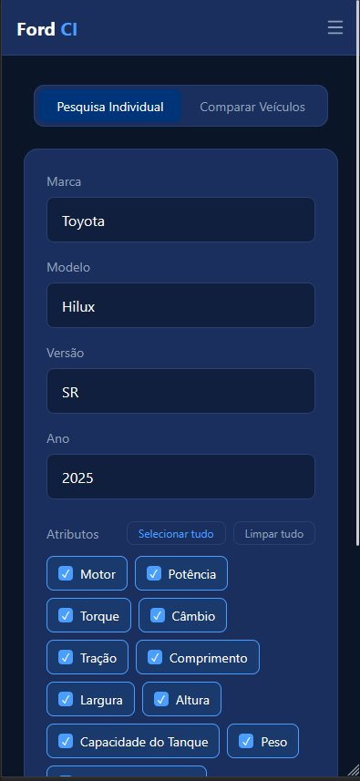
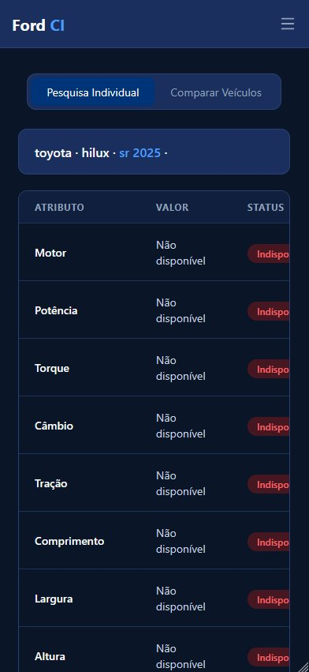
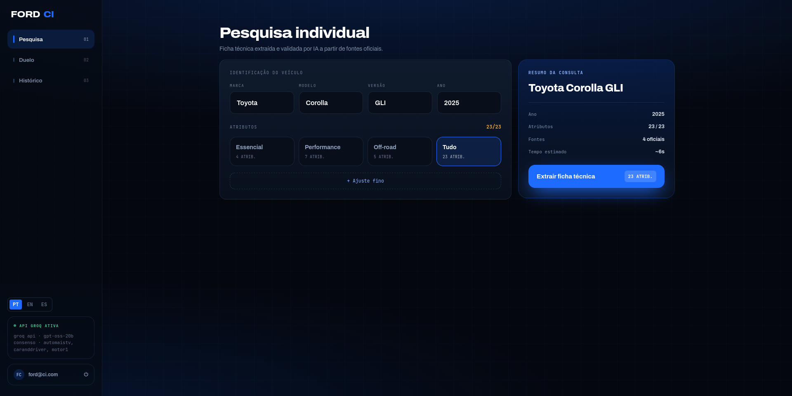
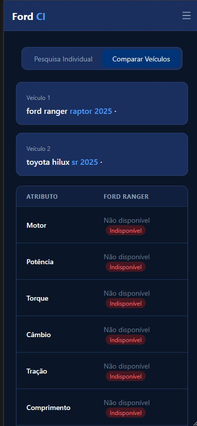

<div align="center">
  <h1>🚙 Ford Commercial Intelligence</h1>
  <p><em>Automação e Inteligência Competitiva para o Mercado Automotivo</em></p>
  <p>
    
    
    
    
    
    
    
  </p>
  <p>
    <b>Desafio Ford FIAP 2026</b> | Desenvolvido por ☁️ <b>Nimbus</b>
  </p>
</div>

## 📌 O Problema

Para manter a liderança no mercado automotivo, equipes de inteligência e marketing precisam comparar seus veículos com os da concorrência constantemente. O problema é que:

- ❌ As especificações técnicas estão espalhadas em PDFs, sites diferentes e vídeos longos.
- ❌ Fazer benchmarking manual leva cerca de **1 hora por versão** de veículo.
- ❌ O processo manual resulta em dados despadronizados (ex: um site usa "kgfm", outro "Nm").

---

## 🚀 A Solução (Proposta de Valor)

O **Ford Commercial Intelligence (Ford CI)** é uma plataforma centralizada que orquestra Web Scraping e Inteligência Artificial para realizar pesquisas de mercado em segundos.

- **Extração com IA:** Lemos artigos da web e transcrevemos vídeos do YouTube de forma autônoma.
- **Consenso Algorítmico:** A IA resolve divergências de dados dando peso a fontes oficiais.
- **Cache Inteligente:** Uma vez pesquisado, o veículo fica salvo (SQLite) e a ficha técnica é entregue instantaneamente na próxima busca.
- **Interface SPA Rápida:** Um dashboard React intuitivo para buscar e comparar veículos concorrentes lado a lado.

*Reduzimos o tempo de mapeamento da concorrência de 1 hora para menos de 10 segundos.*

---

## 🖼️ Demonstração Visual

> A interface foi pensada para ser limpa, responsiva e direta ao ponto.

<div align="center">
  
  
  <br>
  
  
</div>

---

## ✨ Principais Funcionalidades

- ✅ **Autenticação Segura (JWT):** Acesso protegido e histórico atrelado ao usuário.
- ✅ **Busca Inteligente:** Pipeline de IA que extrai as 11 principais especificações (Motor, Potência, Câmbio, Preço, etc).
- ✅ **Comparador Lado a Lado:** Selecione os atributos que importam e compare dois veículos visualmente.
- ✅ **Internacionalização (i18n):** Interface nativamente traduzida para Português, Inglês e Espanhol.
- ✅ **Exportação e Histórico:** Exporte as fichas técnicas em CSV ou acesse suas buscas anteriores a qualquer momento.

---

## 🛠️ Tecnologias Utilizadas

| Ferramenta | Finalidade no Projeto |
| :--- | :--- |
| **FastAPI** | Framework Python de altíssima performance para a construção da API REST. |
| **Scrapy & BeautifulSoup** | Aranhas web programadas para vasculhar sites automotivos e extrair textos brutos. |
| **Groq API (gpt-oss-20b)** | LLM ultrarrápido configurado com *Prompt Engineering* para ler textos e cuspir JSON puro. |
| **React 19 & Vite** | Frontend reativo, componentizado e com build ultra veloz. |
| **Tailwind CSS 4** | Estilização utility-first, garantindo responsividade nativa e design system limpo. |
| **Context API** | Gerenciamento de estado global no frontend (Autenticação e Histórico) sem dependências pesadas. |

---

## 🚀 Como Instalar e Rodar o Projeto

A aplicação é dividida em dois ecossistemas independentes (Backend e Frontend).

### 1️⃣ Subindo o Backend (API)

```bash
# Entre na pasta do backend
cd backend

# Crie e ative um ambiente virtual
python -m venv venv
source venv/bin/activate  # No Windows: venv\Scripts\activate

# Instale as dependências
pip install -r requirements.txt

# Crie o arquivo .env e adicione suas chaves (JWT_SECRET_KEY, GROQ_API_KEY)
cp .env.example .env

# Rode o servidor
uvicorn app.main:app --reload
```

A API estará rodando em: `http://localhost:8000`

### 2️⃣ Subindo o Frontend (React)

> **Importante:** O backend deve estar rodando simultaneamente para que o login e as pesquisas funcionem.

```bash
# Em um novo terminal, entre na pasta do frontend
cd frontend

# Instale as dependências via NPM
npm install

# Suba a aplicação
npm run dev
```

O Dashboard estará disponível em: `http://localhost:5173`

---

## 📖 Contrato da API (Resumo)

A documentação interativa completa, com todos os schemas e testes executáveis, é gerada automaticamente pelo FastAPI e pode ser acessada em **`http://localhost:8000/docs`** ao rodar o projeto.

Abaixo, os endpoints centrais do sistema:

| Método | Endpoint | Descrição | Requer Auth (JWT) |
| --- | --- | --- | --- |
| `POST` | `/auth/token` | Recebe `username` (e-mail) e `password` e retorna o Token JWT. | ❌ |
| `POST` | `/auth/refresh` | Renova o tempo de vida do Token. | ✅ |
| `GET` | `/users/me/` | Retorna o perfil do usuário logado atual. | ✅ |
| `POST` | `/veiculos/busca` | Pipeline de IA: Faz scraping, consenso e extrai especificações do veículo. | ✅ |
| `GET` | `/historico/` | Retorna todas as consultas e comparações salvas pelo usuário. | ✅ |
| `POST` | `/historico/` | Salva uma nova busca (individual ou comparação) no histórico. | ✅ |

---

## 👥 Equipe de Desenvolvimento (Nimbus)

| Função | Integrante | RM |
| --- | --- | --- |
| **IA & Prompt Engineering (Líder Técnico)** | João Victor Soave | RM557595 |
| **Design System & Frontend (UI/UX)** | Maria Alice Freitas | RM557516 |
| **Engenharia de Integração & Segurança** | Pedro Henrique Mendes | RM555332 |
| **Engenharia de Dados & Web Scraping** | Vinícius Bittencourt | RM558909 |
| **Arquitetura de Banco de Dados** | Rafael Lucena | RM555600 |

---

## 📄 Licença

Este projeto é acadêmico e sem vínculo comercial direto. Todos os dados coletados são de fontes públicas e utilizados exclusivamente para fins educacionais e de validação de conceito para a **FIAP**.
