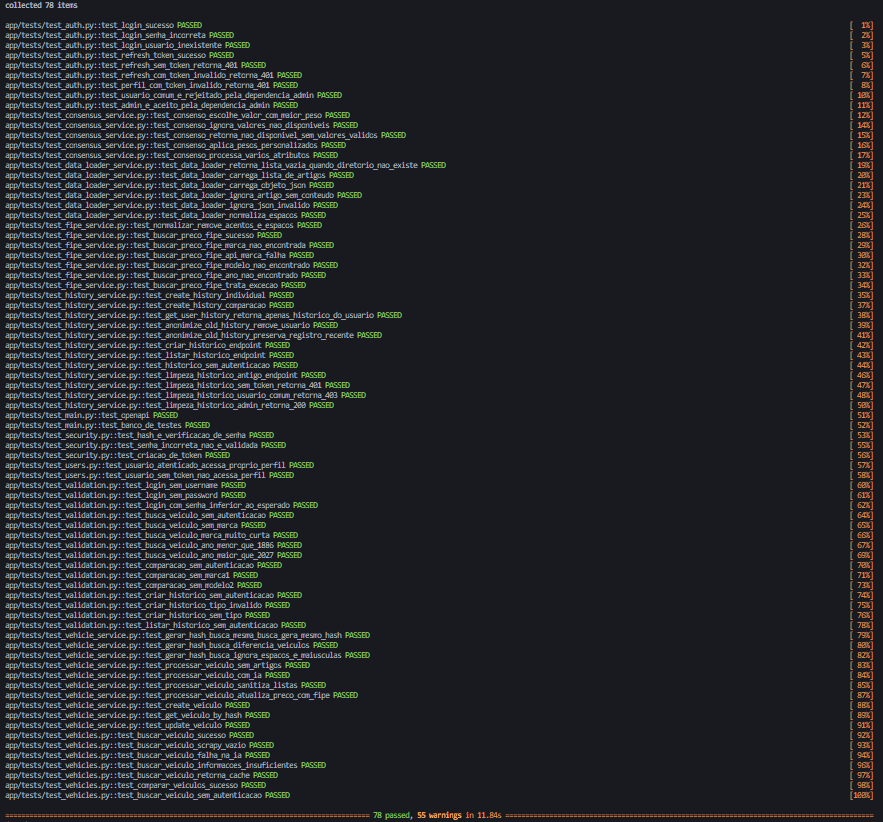
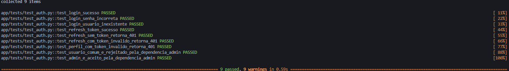
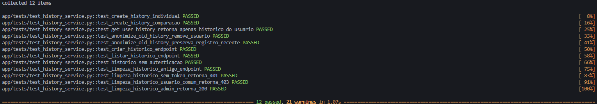
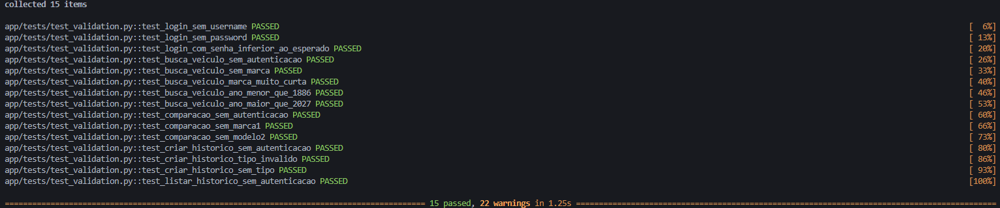
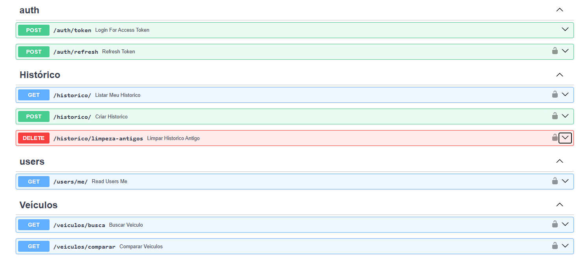

# Documentação da API — Ford Commercial Intelligence

> **Tecnologias:** Python, FastAPI, SQLAlchemy, SQLite, JWT, Pydantic, Scrapy, LLM local via Ollama e integração FIPE via BrasilAPI.

---

## 1. Visão geral

A **Ford Commercial Intelligence API** é um backend REST desenvolvido com FastAPI para consulta, processamento e armazenamento de informações técnicas de veículos.

O fluxo principal da aplicação é:

```text
Cliente
   │
   ├── Autenticação JWT
   │
   ├── Busca de veículo
   │       │
   │       ├── Verificação de cache
   │       ├── Scrapy
   │       ├── LLM local / Ollama
   │       ├── Consenso entre fontes
   │       └── FIPE para atualização de preço
   │
   ├── Comparação entre veículos
   │
   └── Histórico de consultas
           │
           └── Anonimização de registros antigos
```

A aplicação está organizada em camadas:

```text
app/
├── core/             # Configurações, banco e segurança
├── dependencies/     # Dependências de autenticação/autorização
├── models/           # Entidades SQLAlchemy
├── routes/           # Endpoints HTTP
├── schemas/          # Contratos de entrada e saída
├── services/         # Regras de negócio
├── scraping/         # Spiders e configuração do Scrapy
├── tasks/            # Tarefas auxiliares
├── tests/             # Testes automatizados
└── utils/             # Utilitários e logger
```

---

# 2. Arquitetura

A API utiliza uma arquitetura em camadas.

### Routes

Responsáveis por receber requisições HTTP, validar parâmetros, aplicar dependências e encaminhar a operação para os serviços.

Principais arquivos:

- `app/routes/auth_routes.py`
- `app/routes/user_routes.py`
- `app/routes/vehicle_routes.py`
- `app/routes/history_routes.py`

### Schemas

Os schemas Pydantic definem os contratos da API:

- `Token`
- `UserCreate`
- `UserResponse`
- `HistoricoCreate`
- `HistoricoResponse`
- `VeiculoResponse`
- `VeiculoCompareResponse`
- `EspecificacoesSchema`

### Services

A lógica de negócio é concentrada em serviços independentes:

- `AuthService`
- `VehicleService`
- `ConsensusService`
- `DataLoaderService`
- `FipeService`
- `HistoryService`
- `LLMService`
- `ScraperService`

Essa separação permite que as rotas permaneçam responsáveis principalmente pela camada HTTP, enquanto as regras de negócio ficam nos serviços.

---

# 3. Banco de dados

A aplicação utiliza **SQLite**.

A configuração atual aponta para:

```text
fichas.db
```

As principais entidades são:

### Usuário

Tabela:

```text
usuario
```

Campos principais:

| Campo | Tipo | Descrição |
|---|---|---|
| `id` | Integer | Identificador |
| `nome` | Text | Nome do usuário |
| `email` | Text | E-mail único |
| `senha_hash` | Text | Senha armazenada em hash |
| `role` | Text | Perfil (`user` ou `admin`) |
| `criado_em` | Timestamp | Data de criação |

### Veículo

Tabela:

```text
veiculo
```

Além dos dados básicos do veículo, a tabela armazena as especificações técnicas estruturadas, como motor, potência, torque, câmbio, tração, dimensões, consumo, preço e combustível.

### Histórico

Tabela:

```text
historico
```

Armazena as consultas realizadas pelo usuário e possui regras para registros individuais e comparações.

Registros antigos podem ser anonimizados, removendo a associação com o usuário.

---

# 4. Autenticação

A autenticação utiliza **JWT (JSON Web Token)**.

O fluxo é:

```text
POST /auth/token
       │
       ▼
Validação de e-mail e senha
       │
       ├── inválido → 401
       │
       └── válido
              │
              ├── access_token
              └── refresh_token
```

As senhas são armazenadas utilizando hash através do `CryptContext` configurado com Argon2.

---

# 5. Autorização por perfil

Existem dois perfis:

| Perfil | Descrição |
|---|---|
| `user` | Usuário comum autenticado |
| `admin` | Usuário com privilégios administrativos |

A dependência:

```python
get_current_admin_user()
```

verifica o perfil autenticado.

Caso o usuário não seja administrador, a API retorna:

```http
403 Forbidden
```

com:

```json
{
  "detail": "Privilégios insuficientes."
}
```

A operação administrativa atualmente protegida é a limpeza/anonimização do histórico antigo.

---

# 6. Endpoints

## 6.1 Autenticação

### POST `/auth/token`

Realiza login e gera tokens JWT.

#### Corpo

O endpoint utiliza `application/x-www-form-urlencoded`, conforme `OAuth2PasswordRequestForm`.

| Campo | Obrigatório | Descrição |
|---|---|---|
| `username` | Sim | E-mail do usuário |
| `password` | Sim | Senha |

#### Exemplo

```http
POST /auth/token
Content-Type: application/x-www-form-urlencoded

username=teste@teste.com&password=12345678
```

#### Resposta `200 OK`

```json
{
  "access_token": "eyJ...",
  "refresh_token": "eyJ...",
  "token_type": "bearer"
}
```

#### Credenciais inválidas

```http
401 Unauthorized
```

```json
{
  "detail": "Incorrect email or password"
}
```

---

## 6.2 Renovação do token

### POST `/auth/refresh`

Gera um novo access token utilizando um JWT enviado no header `Authorization`.

#### Header

```http
Authorization: Bearer <token>
```

#### Resposta

```json
{
  "access_token": "eyJ...",
  "token_type": "bearer",
  "refresh_token": null
}
```

### Observação de implementação

A implementação atual utiliza `get_current_user()` para validar o token. Portanto, o código atual valida o JWT e o usuário, mas não diferencia explicitamente um token cujo campo `type` seja `refresh` de um access token.

---

# 7. Usuário

## GET `/users/me/`

Retorna os dados do usuário autenticado.

### Autenticação

Obrigatória.

### Header

```http
Authorization: Bearer <access_token>
```

### Resposta `200 OK`

```json
{
  "nome": "Usuário Teste",
  "email": "teste@teste.com",
  "role": "user"
}
```

### Sem autenticação

```http
401 Unauthorized
```

---

# 8. Veículos

## GET `/veiculos/busca`

Busca ou processa a ficha técnica de um veículo.

### Autenticação

Obrigatória.

### Parâmetros

| Parâmetro | Obrigatório | Regra |
|---|---|---|
| `marca` | Sim | 2 a 50 caracteres |
| `modelo` | Sim | 1 a 50 caracteres |
| `versao` | Sim | 1 a 100 caracteres |
| `ano` | Sim | 1886 a 2027 |
| `fonte` | Não | padrão `scrapy_ia_consenso`, máximo 50 |
| `bypass_cache` | Não | força novo processamento |

### Exemplo

```http
GET /veiculos/busca?marca=Ford&modelo=Ranger&versao=Raptor&ano=2025
Authorization: Bearer <access_token>
```

### Fluxo interno

```text
GET /veiculos/busca
        │
        ▼
Gera hash da busca
        │
        ▼
Existe no banco?
   │            │
  SIM          NÃO
   │            │
   ▼            ▼
Retorna      Scrapy
cache           │
                ▼
             LLM/Ollama
                │
                ▼
             Consenso
                │
                ▼
             FIPE
                │
                ▼
             Banco
```

### Limitação

O endpoint possui limite de:

```text
10 requisições por minuto
```

### Validações

A API retorna `422 Unprocessable Entity` quando:

- `marca` não é enviada;
- `marca` possui menos de 2 caracteres;
- `ano` é menor que 1886;
- `ano` é maior que 2027;
- outros parâmetros obrigatórios estão ausentes.

---

# 9. Comparação de veículos

## GET `/veiculos/comparar`

Processa dois veículos simultaneamente e retorna suas fichas para comparação.

### Autenticação

Obrigatória.

### Parâmetros

#### Veículo 1

```text
marca1
modelo1
versao1
ano1
```

#### Veículo 2

```text
marca2
modelo2
versao2
ano2
```

Também podem ser enviados:

```text
fonte
bypass_cache
```

### Exemplo

```http
GET /veiculos/comparar
    ?marca1=Ford
    &modelo1=Ranger
    &versao1=Raptor
    &ano1=2025
    &marca2=Ford
    &modelo2=Mustang
    &versao2=GT
    &ano2=2025
```

### Resposta

```json
{
  "veiculo1": {
    "id": 1,
    "marca": "Ford",
    "modelo": "Ranger",
    "versao": "Raptor",
    "ano": 2025,
    "fonte": "scrapy_ia_consenso",
    "hash_busca": "...",
    "criado_em": "...",
    "especificacoes": {}
  },
  "veiculo2": {
    "id": 2,
    "marca": "Ford",
    "modelo": "Mustang",
    "versao": "GT",
    "ano": 2025,
    "fonte": "scrapy_ia_consenso",
    "hash_busca": "...",
    "criado_em": "...",
    "especificacoes": {}
  }
}
```

### Limitação

```text
5 requisições por minuto
```

---

# 10. Histórico

## POST `/historico/`

Cria um registro de histórico associado ao usuário autenticado.

### Autenticação

Obrigatória.

### Tipo individual

```json
{
  "tipo": "individual",
  "id_veiculo": 1
}
```

### Tipo comparação

```json
{
  "tipo": "comparacao",
  "id_veiculo": 1,
  "id_veiculo1": 1,
  "id_veiculo2": 2
}
```

### Resposta

```http
201 Created
```

---

## GET `/historico/`

Retorna o histórico pertencente ao usuário autenticado.

A consulta é filtrada pelo `id_usuario`, portanto um usuário não recebe o histórico pertencente a outro usuário.

### Sem autenticação

```http
401 Unauthorized
```

---

## DELETE `/historico/limpeza-antigos`

Anonimiza registros antigos do histórico.

### Autorização

Exclusiva para `admin`.

| Situação | Resultado |
|---|---|
| Sem token | `401 Unauthorized` |
| Usuário `user` | `403 Forbidden` |
| Usuário `admin` | `200 OK` |

### Regra

O serviço considera registros com mais de **90 dias**.

A anonimização remove a associação:

```text
id_usuario → NULL
```

sem necessariamente excluir o registro do banco.

### Resposta

```json
{
  "message": "Registros antigos anonimizados com sucesso."
}
```

---

# 11. Validações

A API utiliza validações do FastAPI e Pydantic.

Exemplos testados:

| Cenário | HTTP esperado |
|---|---:|
| Login sem `username` | 422 |
| Login sem `password` | 422 |
| Senha inválida | 401 |
| Busca sem autenticação | 401 |
| Busca sem `marca` | 422 |
| Marca com 1 caractere | 422 |
| Ano menor que 1886 | 422 |
| Ano maior que 2027 | 422 |
| Comparação sem autenticação | 401 |
| Comparação sem `marca1` | 422 |
| Comparação sem `modelo2` | 422 |
| Criação de histórico sem autenticação | 401 |
| Tipo de histórico inválido | 422 |
| Histórico sem `tipo` | 422 |
| Listagem de histórico sem autenticação | 401 |

---

# 12. Integração com Scrapy

A API utiliza spiders Scrapy para coleta de informações automotivas.

Spiders presentes:

```text
AutoMaisTVSpider
CarAndDriverSpider
Motor1Spider
```

O `ScraperService` executa o Scrapy em um **processo separado**, evitando conflito entre o event loop do FastAPI e o processo de crawling.

O resultado é armazenado temporariamente em:

```text
data/raw/
```

e posteriormente consolidado para processamento pela camada de IA.

---

# 13. Processamento por IA

O `VehicleService` centraliza o processamento.

O pipeline é:

```text
Artigos coletados
       ↓
DataLoaderService
       ↓
LLMService
       ↓
Extração estruturada
       ↓
Sanitização dos resultados
       ↓
ConsensusService
       ↓
Resultado consolidado
```

A aplicação utiliza o modelo local:

```text
gemma4:e2b
```

através do Ollama.

O serviço de IA não é inicializado globalmente na rota de veículos. Ele é criado quando o processamento efetivamente é necessário, evitando inicialização desnecessária durante a importação da aplicação e durante a coleta dos testes.

---

# 14. Consenso entre fontes

O `ConsensusService` combina resultados provenientes das fontes de dados.

A estratégia implementada é uma votação ponderada.

O serviço:

- combina múltiplos resultados;
- ignora valores considerados indisponíveis;
- permite pesos diferentes por fonte;
- seleciona o valor com maior peso acumulado;
- retorna `"não disponível"` quando não existe valor válido.

---

# 15. Integração FIPE

A aplicação utiliza a BrasilAPI para consultar informações FIPE.

Fluxo:

```text
Marca
 ↓
Modelos da marca
 ↓
Modelo + versão
 ↓
Ano
 ↓
Preço
```

A normalização remove:

- acentos;
- diferenças entre maiúsculas/minúsculas;
- espaços externos.

Para veículos de ano anterior ao ano atual, o `VehicleService` consulta a FIPE e, quando encontra um preço, substitui o preço extraído pela IA pelo valor retornado pela FIPE.

---

# 16. Segurança

## Hash de senha

As senhas não são armazenadas em texto puro.

O projeto utiliza:

```text
Argon2
```

através do `CryptContext`.

## JWT

Os tokens são assinados utilizando:

```text
HS256
```

O access token possui validade configurada de:

```text
30 minutos
```

O refresh token possui validade configurada de:

```text
7 dias
```

## Autorização

A aplicação diferencia:

```text
user
admin
```

e utiliza dependências FastAPI para controlar operações administrativas.

---

# 17. Testes automatizados

A versão atual contém **78 testes automatizados**.

Distribuição:

| Arquivo | Quantidade | Cobertura |
|---|---:|---|
| `test_auth.py` | 9 | Login, refresh, JWT e autorização |
| `test_consensus_service.py` | 5 | Consenso e pesos |
| `test_data_loader_service.py` | 6 | Leitura e normalização dos artigos |
| `test_fipe_service.py` | 7 | Normalização e integração FIPE |
| `test_history_service.py` | 12 | Histórico, anonimização e autorização |
| `test_main.py` | 2 | OpenAPI e banco de testes |
| `test_security.py` | 3 | Hash, senha e JWT |
| `test_users.py` | 2 | Perfil autenticado |
| `test_validation.py` | 15 | Validação dos endpoints |
| `test_vehicle_service.py` | 10 | Regras do serviço de veículos |
| `test_vehicles.py` | 7 | Endpoints de veículos |
| **Total** | **78** | |

---

# 18. Isolamento dos testes

Os testes utilizam um banco SQLite em memória:

```python
test_engine = create_engine(
    "sqlite://",
    connect_args={"check_same_thread": False},
    poolclass=StaticPool,
)
```

Isso garante que os testes não utilizem o banco de produção.

Além disso, o `conftest.py` substitui o lifespan normal da aplicação por um lifespan específico para testes.

Consequentemente:

- `init_db()` não é executado;
- o administrador de produção não é criado;
- o banco real não é utilizado;
- as tabelas são criadas antes de cada teste;
- as tabelas são removidas ao final de cada teste.

---

# 19. Fixtures de teste

A suíte possui fixtures principais para:

### `db`

Cria um banco SQLite isolado para o teste.

### `client`

Cria um `TestClient` com o banco de testes e as dependências sobrescritas.

### `usuario`

Cria:

```text
Nome: Usuário Teste
E-mail: teste@teste.com
Senha: 12345678
Perfil: user
```

### `admin`

Cria:

```text
Nome: Administrador Teste
E-mail: admin@teste.com
Senha: 12345678
Perfil: admin
```

---

# 20. Evidências da execução

## 20.1 Execução da suíte

No terminal do projeto:

```bash
pytest -v
```

<div align="center">
  
</div>

---

## 20.2 Evidência de autenticação

Executar:

```bash
pytest -v app/tests/test_auth.py
```

O conjunto verifica:

- login correto;
- senha incorreta;
- usuário inexistente;
- refresh;
- token ausente;
- token inválido;
- acesso com token inválido;
- bloqueio de usuário comum em operação administrativa;
- acesso de administrador.

<div align="center">
  
</div>

---

## 20.3 Evidência de autorização

Executar:

```bash
pytest -v app/tests/test_history_service.py
```

Os testes comprovam a matriz:

```text
DELETE /historico/limpeza-antigos

Sem token     → 401
user          → 403
admin         → 200
```

<div align="center">
  
</div>

---

## 20.4 Evidência de validações

Executar:

```bash
pytest -v app/tests/test_validation.py
```

Esse arquivo possui 15 testes específicos de validação e autenticação dos endpoints.

<div align="center">
  
</div>

---

# 21. Evidência da documentação OpenAPI

A aplicação FastAPI disponibiliza documentação automática.

Com a API executando localmente:

```bash
uvicorn app.main:app --reload
```

acesse:

```text
http://127.0.0.1:8000/docs
```

Também está disponível:

```text
http://127.0.0.1:8000/redoc
```

<div align="center">
  
</div>

---

# 22. Matriz geral de endpoints

| Método | Endpoint | Autenticação | Perfil | Validação/resultado |
|---|---|---|---|---|
| POST | `/auth/token` | Não | Todos | 200 / 401 / 422 |
| POST | `/auth/refresh` | Sim | User/Admin | 200 / 401 |
| GET | `/users/me/` | Sim | User/Admin | 200 / 401 |
| GET | `/veiculos/busca` | Sim | User/Admin | 200 / 401 / 404 / 503 / 422 |
| GET | `/veiculos/comparar` | Sim | User/Admin | 200 / 401 / 422 |
| POST | `/historico/` | Sim | User/Admin | 201 / 400 / 401 / 422 |
| GET | `/historico/` | Sim | User/Admin | 200 / 401 |
| DELETE | `/historico/limpeza-antigos` | Sim | **Admin** | 200 / 401 / 403 |

---

# 23. Estratégia de testes

A suíte foi dividida em quatro níveis principais:

### Testes unitários

Validam funções isoladas, como:

- hash de senha;
- criação de JWT;
- geração de hash do veículo;
- consenso;
- normalização FIPE;
- carregamento de artigos.

### Testes de serviço

Validam regras de negócio:

- `VehicleService`;
- `HistoryService`;
- `ConsensusService`;
- `FipeService`;
- `DataLoaderService`.

### Testes de endpoint

Utilizam `TestClient` para validar o comportamento HTTP da API.

### Testes de segurança e validação

Validam:

- autenticação;
- autorização;
- ausência de token;
- token inválido;
- perfil `user`;
- perfil `admin`;
- parâmetros obrigatórios;
- limites de parâmetros;
- valores inválidos.

---

# 24. Comandos para reprodução

## Instalação do ambiente

```bash
python -m venv venv
```

Windows:

```bash
source venv/Scripts/activate
```

ou no CMD:

```cmd
venv\Scripts\activate
```

Depois:

```bash
pip install -r requirements.txt
```

## Executar a API

```bash
uvicorn app.main:app --reload
```

## Executar todos os testes

```bash
pytest -v
```

## Executar somente autenticação

```bash
pytest -v app/tests/test_auth.py
```

## Executar somente veículos

```bash
pytest -v app/tests/test_vehicles.py
```

## Executar somente histórico/autorização

```bash
pytest -v app/tests/test_history_service.py
```

## Executar somente validações

```bash
pytest -v app/tests/test_validation.py
```

---
